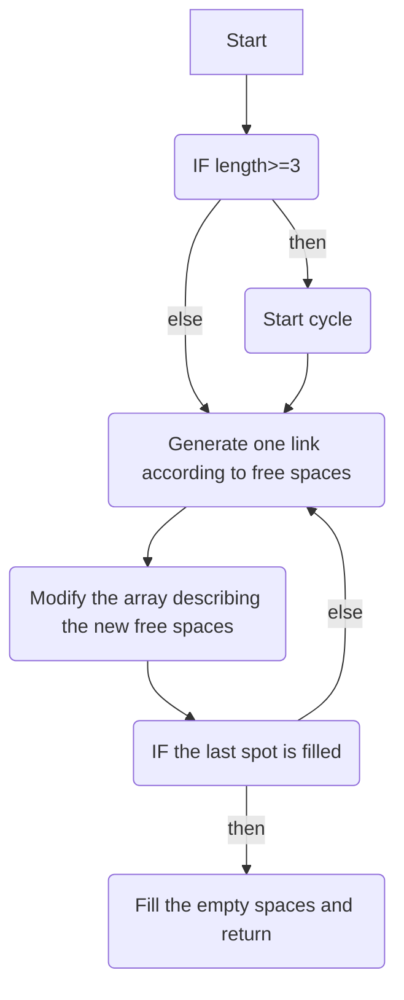

# Task description
Write a function, which takes 3 arguements: pointer to an array of char, length of the array *L*, length of an alphabet *N*.
The function has to fill the array with a random entangled word made of the first N letters of the english alphabet.

# Entanglement definition
The string is entangled if it is impossible to split it into 2 substrings so they contain non-intersecting sets of letters.

#Algorithm


```
##Example: 
1) ABCDA
A-BCDA; AB-CDA; ABC-DA; ABCD-A - both parts contain A no matter the division position.
2) ABACDBF
There can be a split ABACDB-F. The left set does not contain F, The right one does not contain any of the letters {A,B,C,D}.

#Trivial cases:
A - Cannot be split
AA, A...A - Any string which has the first and last letters the same is entangled.

#Non-trivial cases:
ABAB - We can imagine this as two physical links being connected

---
| |
ABAB
 | |
 ---
 
Trivial cases are chains of length 1.

A.....B...A....B Only the relative position of repeated letters matter, the spaces between them can be any length (but big anough to allow next link grab).

---------   ---------
|       |   |       |
A...B...A...C...B...C
    |           |
    -------------
Chain is always entangled, so we can generate a chain, and then fill the spaces with random letters. 

-------------
|           |
A...B...C...A...B...C 
        |           |
        -------------
In this case we don't have to look at BB link, 
as the whole string is already connected by AA and CC.

	
-------------
|           |
A...C...B...A...B...C
    |               |
    -----------------
In this case we don't have to look at BB link, 
as the whole string is already connected by AA and CC.


-------------
|           |
A...C...B...AC....... 
    |        |		
    ----------
This case is not self sufficient. The next link will make CC abundant. 
So the right part of CC should not touch the rightmost already written letter.

-------------
|           |
A...C.......A..C....... 
    |          |		
    ------------
	The left part of new DD should hook between right pair A and C. 
	A DD link with more left left end could have generated instead of CC.

The only 2 cases we have to diverge from the cycle of creating links: 
0) end of array reached.
1) A a right end of a link generated next to the same letter
***** -> AA*** -> Generate A again -> AA*a** -> AAaAa* not enough space for a new link.
C**C** -> C**CCC* We can prevent this case as described in 4.

So when generating a link it's enough to place its left end within a recent space inside the previous link. 
The right end can be anywhere further, than i+1 position to allow a new link hooking.

##Idea 1: 
Let's generate an entangled string step by step and think about the algorithm. Length 10, alphabet {A,B,C,D,E}
1. Place a random letter on the first place of the array.
C*********	Finish the link by generating right end anywhere {3,10}. We skip index 2 to allow further hooking. 
C*-------- Possible places for C. 
Note: C can still appear on the second place as a a result of random filling of the finished chain or as a next link left end.
Same applies to all the overshoots I will make.
Guaranteed, that overshoot makes sure I have at least 2 spaces left at suitable positions for a new link.
2. C**C****** Now we have 2 regions. During programming we will have to keep track of both available regions. 
I'll create an array to keep all 4 indices. At the very beginning the array will be [0,0,3,length-1].
3. Start a cycle of creating links and redacting the structure of indices.
4. Choose a new random letter (It can be C again!). B can be placed in "-": C--C*-----. 
!!! If at any point a letter is placed on the last place in the array, 
finish the cycle of creating links and go to filling the empty spaces with random letters.
Keep track of the rightmost and the second from the right filled spots, to define space for a left part of a link.
C*BC****B*
5. A new link can be created in places: {5,6,7,8} and {10,10}. 
Those can always be defined by a 4 number structure, in this case [5,8,10,10].
We don't have to link through 2nd position, as it would be dublication of linkage like in 4th non trivial example. 
Some "link" might still appear there as a part of filling, but for structural purpose we do not need that.
C*BC**D*BD
6. At this point the end of array is reached, so the entanglement is guaranteed.
7. Fill
CaBCedDaBD - Here we got an a link through 2, although we ignored the place.

If we allow generation without overshoot we might get CC... 
(if we dont leave space as described in 1. and 4.), 
in which case we have to generate specifically C again. CC*C*
It's unnecessary branching.

C*BC****B* [5,8,10,10] -> we don't need a link between 2 and 5-8. 
It could have generated instead of BB.
```